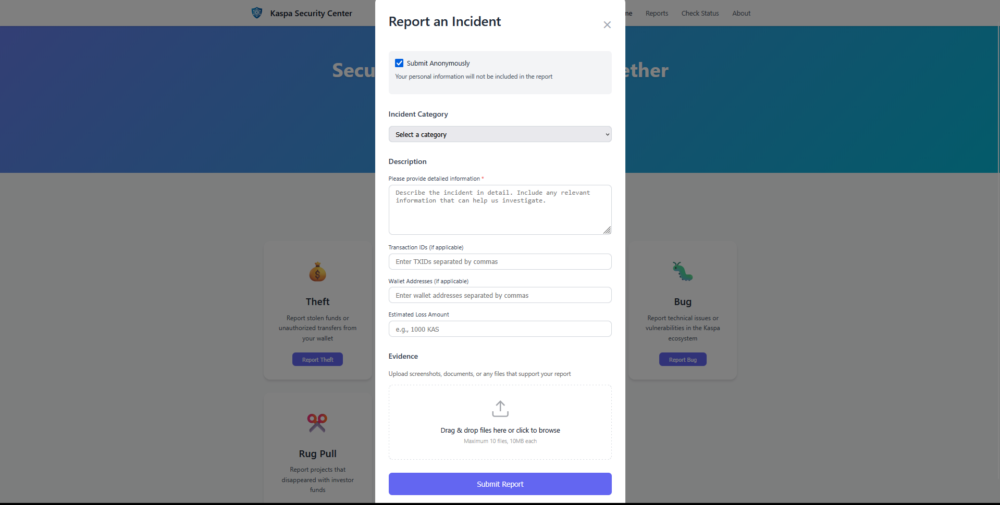
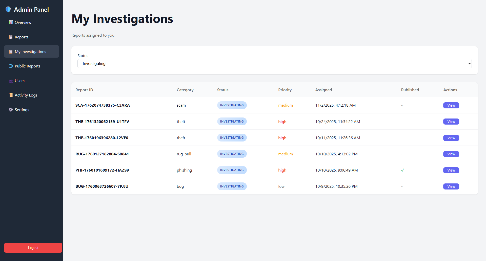

# Kaspa Security Center

<p align="center">
  
</p>

<p align="center">
  <strong>Community-driven security incident reporting for the Kaspa ecosystem</strong>
</p>

<p align="center">
  <a href="#features">Features</a> •
  <a href="#documentation">Documentation</a> •
  <a href="#quick-start">Quick Start</a> •
  <a href="#contributing">Contributing</a> •
  <a href="#license">License</a>
</p>

---

## What is Kaspa Security Center?

Kaspa Security Center is an open-source platform for reporting and tracking security incidents in the Kaspa ecosystem. It bridges the gap between victims of theft, scams, and fraud and those who can help — investigators, exchanges, and law enforcement.

<p align="center">
  
</p>

### Why it exists

Blockchain transparency means stolen funds can be traced — but only if incidents are reported and documented properly. The Security Center removes barriers to reporting by allowing anonymous submissions, providing transparent status tracking, and coordinating with authorities when needed.

---

## Features

- **Anonymous Reporting** — Submit reports without creating an account
- **Category-Specific Data Collection** — Tailored forms for theft, scams, phishing, bugs, rug pulls, and abuse
- **Transparent Tracking** — Reporters check status with a simple Report ID
- **Admin Dashboard** — Full case management for investigators
- **Authority Coordination** — Track escalations to exchanges and law enforcement
- **Public Reports** — Publish resolved cases to warn the community
- **Email Notifications** — Automatic updates at key milestones

---

## Documentation

| Document | Description |
|----------|-------------|
| [kaspa-security-center.md](./kaspa-security-center.md) | Technical documentation — installation, configuration, API reference, deployment |
| [admin-guide.md](./admin-guide.md) | Admin panel user guide — how to manage reports, coordinate with authorities, communicate with reporters |

---

## Quick Start

```bash
# Clone the repository
git clone https://github.com/kasperolabs/kaspa-security-center.git
cd kaspa-security-center

# Install dependencies
npm install

# Configure environment
cp .env.example .env
# Edit .env with your database and email settings

# Start the server
npm run dev
```

The Security Center will be running at `http://localhost:3000` with the admin panel at `/admin`.

See [kaspa-security-center.md](./kaspa-security-center.md) for detailed setup instructions.

---

## Admin Panel

<p align="center">
  
</p>

The admin panel provides investigators with tools to manage reports, track authority contacts, communicate with reporters, and publish public warnings.

See [admin-guide.md](./admin-guide.md) for the complete user guide.

---

## Tech Stack

- **Backend**: Node.js, Express
- **Database**: MySQL with Sequelize ORM
- **Authentication**: JWT
- **Security**: Helmet, rate limiting, bcrypt
- **Email**: Nodemailer

---

## Contributing

Contributions are welcome. Please open an issue first to discuss what you'd like to change.

---

## License

MIT — see [LICENSE](./LICENSE) for details.

---

<p align="center">
  Built with 💚 for the Kaspa ecosystem by <a href="https://github.com/kasperolabs">Kaspero Labs</a>
</p>
